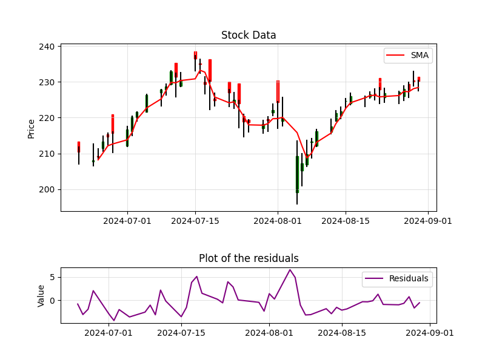

# Intro to ML - Assignment 3 Proposal

**Authors:**
- Iva I. Ivanova (s5614260)
- Katya T. Toncheva (s5460786)
- Petar I. Penchev (s4683099)

**Date:** December 25, 2024

## Goal

The goal of this project is to develop an ensemble model comprised of a feedforward neural network (FFNN) and a long short-term memory (LSTM) recurrent neural network (RNN) tasked with predicting closing prices of a stock.

## Project Description

The FFNN is designed to predict the residuals between the closing prices and the trendline, represented by the simple moving average (SMA), which is also referred to as the running average. Meanwhile, the LSTM is responsible for extrapolating the SMA. By combining these two components, the model aims to forecast closing prices more effectively. This work is inspired by and builds on a previous project ([source](#mycourseproject2024)).

## Materials

### Dataset

The data used for training both machine learning models is sourced from the Yahoo API. It is accessed through the library `yfinance` (v. 0.2.44). The data used is referred to as a "candlestick", a tuple containing ("date", "open price", "highest price", "lowest price", "close price").

### Preprocessing the data for the FFNN

In training the FFNN, what we care about are the residuals. The residuals are the difference between the closing prices and the trend of the stock data. This trend is computed using a simple moving average through the closing prices:

\[
\text{SMA(date)} = \frac{1}{N} \sum^N_{n=1} \text{Closing Price(date-N)}
\]

Where $\text{Closing Price(date-N)}$ is the closing price at a particular past date, $N$ is the number of units of "lookback" time we are interested in, and SMA(date) is the simple moving average. Thus, the residuals are defined as:

\[
\text{Residual(date)} = \text{Closing Price(date)} - \text{SMA(date)}
\]

Where $\text{Closing Price(date)}$ is the closing price, $\text{SMA(date)}$ is the simple moving average, and $\text{Residual(date)}$ is the residual at a particular date ([source](#mycourseproject2024)).

### Preprocessing the data for the LSTM

In training the LSTM, what we are trying to predict is the trend. This trend is computed using the simple moving average through the closing prices (refer to the equation above). Then, the data is normalized to help make the inputs more balanced and reduce the impact of any outliers in the data. One can refer to the figure below for an example of the data that is going to be used in training these models.

### Model

We will restrict ourselves to a smaller-sized FFNN in accordance with the findings in [source](#mycourseproject2024), specifically a maximum of 2 layers and a neuron size no bigger than 16 per hidden layer.

Regarding the LSTM, we still have not decided on an exact architecture.

### Metrics

We will definitely look at the Mean Absolute Error (MAE) as one of the metrics, but we might implement more than one.

## Appendix

### Example Data

This is an example of the data that is going to be used to train the two components of this ensemble model. The red line in the graph on the top represents the Simple Moving Average for the past 3 days. This type of data, after preprocessing, is used to train the LSTM. While the graph on the bottom represents the corresponding residuals (as defined in the Preprocessing section) which are used to train the FFNN. This is the stock data of "AAPL".

## References

1. [mycourseproject2024]
